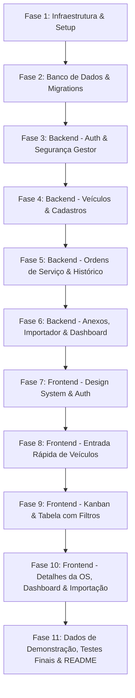

# R-Fleet — Plano de Implementação em Etapas

> **Status:** Proposta para Aprovação  
> **Estratégia:** Entregas incrementais com commits atômicos no padrão Conventional Commits (`feat:`, `fix:`, `docs:`, `chore:`), testes automatizados e validação contínua.

---

## Visão Geral das Fases

---

## Detalhamento das Etapas

### Fase 1: Setup do Repositório e Infraestrutura Local
* **Objetivo:** Estabelecer a fundação do monorepo, configuração de containers e pipeline CI.
* **Tarefas:**
  1. Configuração do `docker-compose.yml` com serviço PostgreSQL 16 e volume persistente.
  2. Inicialização do projeto Spring Boot 3 (`backend/`) com Java 21, Maven/Gradle, dependências (`spring-boot-starter-web`, `spring-boot-starter-data-jpa`, `spring-boot-starter-security`, `flyway-core`, `postgresql`, `validation`, `lombok`).
  3. Inicialização do projeto React 19 / Vite (`frontend/`) com TypeScript.
  4. Configuração do `.github/workflows/ci.yml` para rodar compilação e testes em cada push/PR.
* **Critério de Aceite:** `docker compose up` sobe o banco local; backend e frontend compilam sem erros.

---

### Fase 2: Banco de Dados, Migrations Flyway e Seeds
* **Objetivo:** Estruturar o esquema relacional conforme a especificação de design.
* **Tarefas:**
  1. Criação da migration `V1__criar_esquema_inicial.sql`:
     * Tabelas `usuarios`, `origens`, `tipos_servico`, `veiculos`, `ordens_servico`, `historico_etapas`, `anexos_os`, `configuracoes`.
     * Índices de performance e constraint de unicidade parcial para veículo ativo (`idx_os_veiculo_ativo_unica`).
  2. Criação da migration `V2__dados_iniciais_padrao.sql`:
     * Origens padrão: *Cliente, Oficina, Concessionária, Seguradora, Movida, Unidas, Outro*.
     * Tipos de serviço: *Mecânica, Funilaria*.
     * Parâmetros de configuração: `LIMITE_DIAS_ALERTA_PARADO = 15`.
     * Usuário gestor padrão inicial (com senha encriptada via BCrypt).
* **Critério de Aceite:** Migrations executam com sucesso contra o PostgreSQL limpo.

---

### Fase 3: Backend — Autenticação e Segurança (Gestor Único)
* **Objetivo:** Garantir login com e-mail/senha, emissão de tokens JWT e proteção das rotas da API.
* **Tarefas:**
  1. Implementação de `Usuario` (Domain, Repository) com e-mail, senha com hash e status ativo.
  2. Configuração de `SecurityConfig`, `JwtService`, `JwtAuthenticationFilter` e codificador `BCryptPasswordEncoder`.
  3. Endpoints `POST /api/auth/login` e `GET /api/auth/me`.
  4. Testes unitários e de integração de autenticação e proteção de rotas com JUnit 5.
* **Critério de Aceite:** Tokens emitidos corretamente; rotas protegidas exigem token válido (401/403 se ausente/inválido).

---

### Fase 4: Backend — Domínio de Veículos e Cadastros Auxiliares
* **Objetivo:** Gestão de origens, tipos de serviço e veículos com validação e sanitização de placas.
* **Tarefas:**
  1. CRUDs de `Origem` e `TipoServico`.
  2. Implementação do domínio `Veiculo`:
     * Normalização e sanitização automática de placa (maiúsculas, sem traço).
     * Validador Customizado Bean Validation para formato tradicional (`ABC1234`) e Mercosul (`ABC1D23`).
  3. Endpoint otimizado `GET /api/veiculos/buscar-placa/{placa}` para responder com os dados prévios e status de OS ativa em < 50ms.
* **Critério de Aceite:** Placas inválidas rejeitadas com erro 400; busca por placa retorna modelo e origem corretos.

---

### Fase 5: Backend — Ordens de Serviço, Máquina de Estados e Histórico
* **Objetivo:** Núcleo operacional da oficina com controle de transições, regras de saída e log de auditoria.
* **Tarefas:**
  1. Implementação de `OrdemServico` e `HistoricoEtapa`.
  2. Endpoint `POST /api/ordens-servico` (Registrar Entrada):
     * Cria ou associa veículo existente.
     * Valida se veículo já possui OS ativa (retorna erro amigável se houver).
     * Registra o evento inicial no histórico.
  3. Endpoint `PATCH /api/ordens-servico/{id}/etapa`:
     * Valida transição de etapa.
     * Ao transicionar para `FINALIZADO` ou posterior, infere `servico_concluido = true`.
     * Ao transicionar para `ENTREGUE`, preenche automaticamente `data_saida` caso nula.
     * Grava registro imutável no `HistoricoEtapa` com autor, data/hora e observação.
  4. Endpoint `GET /api/ordens-servico`:
     * Filtros dinâmicos com Spring Data Specifications (placa, etapa, origem, faturado, data, alerta de atraso).
  5. Endpoints de atualização de orçamento e status de faturamento com registro no histórico.
* **Critério de Aceite:** Testes cobrem o fluxo completo de entrada, transição de etapas, data de saída automática e persistência de histórico.

---

### Fase 6: Backend — Anexos, Importador da Planilha e Métricas
* **Objetivo:** Manipulação de arquivos, migração dos dados legados e cálculo do dashboard.
* **Tarefas:**
  1. Upload e download seguro de anexos (`/api/ordens-servico/{id}/anexos`): fotos e PDFs de orçamentos.
  2. Serviço de importação de planilha (`/api/importacao/planilha`):
     * Suporte a `.xlsx` e `.csv`.
     * Mapeamento da Coluna G como `data_entrada`.
     * Parser inteligente de valores monetários e status faturado.
     * Transação com relatório detalhado de sucessos e falhas por linha.
  3. Endpoint de exportação de dados filtrados para CSV e Excel.
  4. Endpoint `GET /api/dashboard/metricas`:
     * Agrupamento de carros no pátio por etapa.
     * Contagem de entradas/saídas no mês.
     * Cálculo de tempo médio de permanência.
     * Filtro de veículos com SLA estourado (> 15 dias).
     * Totais financeiros: total orçado em aberto vs. faturado.
* **Critério de Aceite:** Importação de planilha de teste conclui sem perda de linhas; métricas calculadas com precisão.

---

### Fase 7: Frontend — Design System, Layout Base e Autenticação
* **Objetivo:** Interface moderna, responsiva e de alta usabilidade, com identidade visual profissional.
* **Tarefas:**
  1. Construção do Design System em Vanilla CSS com design tokens (`index.css`): paleta de cores (modo escuro/claro elegante, semáforo verde/amarelo/vermelho), tipografia moderna e componentes base (botões, badges, cards, inputs com máscara).
  2. Layout responsivo com Topbar (busca global, atalho para nova entrada, perfil do gestor) e Sidebar adaptável para mobile (barra inferior no pátio).
  3. Integração de autenticação: Contexto de autenticação, tela de login elegante, armazenamento seguro do token JWT e redirecionamento de rotas protegidas.
* **Critério de Aceite:** Login funcional; layout se adapta fluidamente a telas de smartphone (375px) e desktop (1920px).

---

### Fase 8: Frontend — Fluxo de Entrada Rápida (< 30 segundos)
* **Objetivo:** Substituir a velocidade da macro do Excel com experiência ágil no pátio.
* **Tarefas:**
  1. Modal e página de "Nova Entrada de Veículo":
     * Campo de Placa com máscara e debounce para consulta instantânea na API.
     * Preenchimento automático de Modelo e Origem para veículos recorrentes.
     * Alerta visual e bloqueio caso a placa já esteja em serviço aberto na oficina.
     * Campos em maiúsculas automáticas.
     * Data de entrada pré-selecionada como hoje.
     * Atalhos de teclado: Enter para cadastrar, ESC para fechar.
  2. Feedback visual claro de sucesso com link imediato para a OS gerada.
* **Critério de Aceite:** Cadastro de um veículo concluído em menos de 30 segundos em testes manuais e cronometrados.

---

### Fase 9: Frontend — Quadro Kanban Interativo e Tabela com Filtros
* **Objetivo:** Dupla visualização operacional da oficina: fluxo visual (Kanban) e lista gerencial (Tabela).
* **Tarefas:**
  1. **Quadro Kanban:**
     * 7 colunas (Aguardando Orçamento até Entregue) com contador de veículos por coluna.
     * Cards informativos com placa em destaque, modelo, tag de origem e badge de tempo na oficina.
     * Semáforo de cores: verde (concluído), amarelo (em aberto no prazo), vermelho (alerta de atraso > 15 dias).
     * Drag-and-drop fluido para troca de etapa com confirmação quando necessário.
  2. **Tabela de Veículos:**
     * Barra de pesquisa com filtros múltiplos combinados (etapa, origem, faturado, status de atraso).
     * Ordenação por colunas e paginação ágil.
     * Botões para download em CSV e Excel.
* **Critério de Aceite:** Mudar a etapa de um carro com 1 clique ou arrastando; identificar instantaneamente carros atrasados em vermelho.

---

### Fase 10: Frontend — Detalhes da OS, Dashboard e Importador
* **Objetivo:** Visão profunda do histórico de cada veículo, relatórios gerenciais e ferramenta de migração.
* **Tarefas:**
  1. **Tela de Detalhes da OS:**
     * Cabeçalho de ações rápidas (Avançar Etapa, Registrar Saída, Marcar Faturado).
     * Linha do tempo vertical ilustrando todo o histórico cronológico de etapas e observações.
     * Painel de anexos (fotos de vistoria e orçamentos em PDF) com suporte a arrastar e soltar.
  2. **Dashboard Gerencial:**
     * Cards de KPIs no topo.
     * Gráfico de distribuição por etapa.
     * Bloco financeiro: total orçado em aberto vs. faturado.
     * Tabela de veículos em atenção prioritária.
  3. **Tela de Importação da Planilha:**
     * Upload do arquivo legado (.xlsx / .csv).
     * Tabela de pré-visualização das linhas com validações visuais antes da gravação definitiva.
* **Critério de Aceite:** Timeline renderiza histórico completo; importador pré-visualiza e confirma dados sem inconsistências.

---

### Fase 11: Dados de Demonstração (Seed), Validação E2E e README
* **Objetivo:** Deixar o sistema pronto para apresentação e uso imediato com documentação clara.
* **Tarefas:**
  1. Criação do script de seed com veículos e ordens de serviço realistas distribuídos em todas as etapas (inclusive com carros atrasados para demonstrar o alerta vermelho).
  2. Criação da conta de demonstração do gestor:
     * e-mail e senha definidos pelas variáveis `RFLEET_GESTOR_*` (nunca versionados)
  3. Elaboração do `README.md` completo: instruções para rodar com Docker Compose ou localmente, variáveis de ambiente, portas e guia rápido de uso.
  4. Revisão dos critérios de aceite do MVP (seção 8 do prompt original).
* **Critério de Aceite:** Qualquer desenvolvedor ou usuário consegue subir o projeto com 1 comando e testar todos os fluxos com dados prontos.
