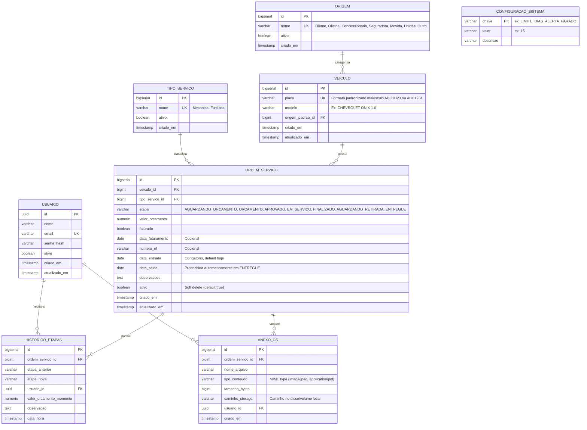

# R-Fleet — Especificação de Design e Arquitetura do Sistema

> **Status:** Proposta Inicial para Aprovação  
> **Versão:** 1.0.0  
> **Data:** Outubro/2026  
> **Autor:** Antigravity & Equipe de Engenharia  

---

## 1. Visão Geral e Objetivos do Produto

O **R-Fleet** é um sistema web responsivo desenvolvido para substituir planilhas manuais (com macros) no gerenciamento operacional de oficinas mecânicas e de funilaria. O foco central é o rastreamento em tempo real do ciclo de vida dos veículos no pátio: **Entrada → Etapas de Reparo → Saída**, provendo histórico imutável, alertas visuais de permanência e visões gerenciais (Dashboard e Kanban).

### Premissas e Definições Alinhadas
1. **Volume Inicial:** Até 100 veículos/mês (pequeno/médio porte).
2. **Topologia:** Unidade única de oficina física no MVP.
3. **Controle Orçamentário:** Valor único editável na Ordem de Serviço, com registro de data e motivo de alteração no histórico/timeline.
4. **Faturamento:** Flag binária (*Sim/Não*) acompanhada de campos opcionais de auditoria (data de faturamento e número/referência da Nota Fiscal).
5. **Autenticação e Gestão:** Apenas uma pessoa fará a gestão do sistema, com autenticação segura via e-mail e senha (JWT). Sem múltiplos perfis/RBAC: o gestor autenticado tem acesso total a todas as operações, cadastros e valores financeiros.

---

## 2. Modelo de Dados Relacional (PostgreSQL)

O modelo separa o conceito imutável do **Veículo** (entidade durável que pode retornar várias vezes à oficina) da **Ordem de Serviço (OS)** (cada passagem do veículo pelo pátio).



### Detalhamento das Tabelas e Constraints

#### Tabela `veiculos`
* `placa`: `VARCHAR(10) NOT NULL UNIQUE`. Armazenada em maiúsculas sem traços para busca universal (ex: `ABC1D23` ou `ABC1234`).
* `modelo`: `VARCHAR(100) NOT NULL`. Armazenado sempre em maiúsculas com `trim()`.
* `origem_padrao_id`: `BIGINT REFERENCES origens(id)`.

#### Tabela `ordens_servico`
* **Constraint de Unicidade Operacional Ativa:**  
  Não pode existir mais de uma OS em aberto para o mesmo veículo.  
  *Índice Parcial PostgreSQL:*  
  ```sql
  CREATE UNIQUE INDEX idx_os_veiculo_ativo_unica 
  ON ordens_servico (veiculo_id) 
  WHERE etapa <> 'ENTREGUE' AND ativo = true;
  ```
* `valor_orcamento`: `NUMERIC(12, 2) NOT NULL DEFAULT 0.00`.
* `faturado`: `BOOLEAN NOT NULL DEFAULT FALSE`.
* `data_entrada`: `DATE NOT NULL DEFAULT CURRENT_DATE`.
* `data_saida`: `DATE NULL`.

#### Tabela `historico_etapas`
* Registro obrigatório e imutável para **qualquer** transição de etapa ou alteração substancial de orçamento.
* `data_hora`: `TIMESTAMP WITH TIME ZONE NOT NULL DEFAULT CURRENT_TIMESTAMP`.

---

## 3. Regras de Negócio e Máquina de Estados

### 3.1. Ciclo de Vida e Máquina de Estados das Etapas
O fluxo padrão de transição segue:

```
[1. Aguardando Orçamento]
         ↓
    [2. Orçamento]
         ↓
    [3. Aprovado]
         ↓
   [4. Em Serviço]
         ↓
   [5. Finalizado]  ──> (Marca automaticamente serviço_concluido = true)
         ↓
[6. Aguardando Retirada]
         ↓
    [7. Entregue]   ──> (Preenche data_saida = data_atual se nula; libera placa para nova OS)
```

* **Transições Permitidas:**
  * Avançar para a próxima etapa em 1 clique ou arrastando no Kanban.
  * Regressão permitida (ex.: de *Em Serviço* volta para *Orçamento* caso surja nova peça/avaria), solicitando motivo obrigatório no modal.
  * Pular etapas é permitido para administradores/operadores com confirmação (ex.: carro entra já aprovado com orçamento prévio de seguradora).
* **Serviço Concluído (Derivado):**
  * Não é um campo persistido isoladamente.  
  * `servico_concluido = true` quando `etapa IN ('FINALIZADO', 'AGUARDANDO_RETIRADA', 'ENTREGUE')`.
* **Data de Saída Automática:**
  * Ao ser movido para `ENTREGUE`, se `data_saida` for nula, o sistema define automaticamente a data corrente (`LocalDate.now()`). O usuário pode editar a data caso a entrega física tenha ocorrido em data anterior.
  * Se o veículo for retirado de `ENTREGUE` (reabertura por garantia ou correção), o sistema emite alerta questionando se a data de saída deve ser cancelada.

### 3.2. Validação e Sanitização de Placas
* Aceita formatos tradicionais (`AAA-9999`) e padrão Mercosul (`AAA9A99`).
* Regex de validação: `^([A-Z]{3}[0-9]{4}|[A-Z]{3}[0-9][A-Z][0-9]{2})$`.
* Sanitização automática no backend e no frontend: remoção de hífens, espaços e conversão para maiúsculas.
* Ao digitar a placa no formulário de entrada, o sistema busca o veículo instantaneamente: se já cadastrado, preenche automaticamente modelo e origem. Se tiver OS aberta, exibe alerta impeditivo com atalho para a OS existente.

### 3.3. Cálculo de Tempo de Permanência e Alerta Visual de SLA
* **Cálculo de Dias no Pátio:**
  * Veículo no pátio (`data_saida` nula): `dias = CURRENT_DATE - data_entrada`.
  * Veículo finalizado/entregue (`data_saida` não nula): `dias = data_saida - data_entrada`.
* **Semáforo Visual de Status:**
  * **Verde (Concluído):** `etapa IN ('FINALIZADO', 'AGUARDANDO_RETIRADA', 'ENTREGUE')`.
  * **Amarelo (Em Aberto no Prazo):** `etapa NOT IN (...)` e `dias <= 15`.
  * **Vermelho (Alerta de Gargalo/Parado):** `etapa NOT IN (...)` e `dias > 15` (parâmetro configurável no banco).

### 3.4. Controle de Acesso e Autenticação
* **Gestor Único:** O sistema é operado por uma única pessoa responsável pela oficina.
* **Autenticação Segura:** Protegida por e-mail e senha com hash BCrypt e emissão de token JWT.
* **Acesso Integral:** O gestor autenticado possui visão e controle irrestrito sobre todas as funcionalidades: registro de entradas, alterações de etapa, visualização e edição de orçamentos e faturamento, upload de anexos, visualização de métricas e ferramentas de importação/exportação. Todas as rotas da API (exceto `/api/auth/login`) exigem token JWT válido.

---

## 4. Arquitetura da API REST (Spring Boot 3)

A API utiliza autenticação baseada em JWT (Bearer Token) e segue os padrões RESTful com retorno padronizado (`application/json`).

### 4.1. Autenticação & Conta
* `POST /api/auth/login`: Autentica com e-mail e senha. Retorna token JWT.
* `GET /api/auth/me`: Retorna dados do gestor autenticado.

### 4.2. Veículos & Validação
* `GET /api/veiculos/buscar-placa/{placa}`: Consulta rápida para autocomplete na entrada. Retorna dados do veículo e se possui OS ativa.
* `GET /api/veiculos`: Listagem paginada de veículos cadastrados.

### 4.3. Ordens de Serviço (Operacional Principal)
* `GET /api/ordens-servico`: Lista com filtros dinâmicos:
  * `termo` (busca em placa/modelo)
  * `etapa` (múltiplas etapas)
  * `origemId`
  * `tipoServicoId`
  * `faturado` (true/false)
  * `concluido` (true/false)
  * `emAtraso` (true/false)
  * `dataEntradaInicio`, `dataEntradaFim`
  * `page`, `size`, `sort`
* `POST /api/ordens-servico`: Registra entrada (cria veículo se não existir + cria OS + cria primeiro registro no histórico).
* `GET /api/ordens-servico/{id}`: Detalhe completo da OS.
* `PUT /api/ordens-servico/{id}`: Edição de dados cadastrais da OS.
* `PATCH /api/ordens-servico/{id}/etapa`: Transição rápida de etapa (drag-and-drop no Kanban ou botão de ação). Payload: `{ novaEtapa, observacao }`.
* `PATCH /api/ordens-servico/{id}/faturamento`: Alterna status de faturamento (Sim/Não), data e NF.
* `PATCH /api/ordens-servico/{id}/orcamento`: Altera valor do orçamento com justificativa/log.
* `DELETE /api/ordens-servico/{id}`: Arquivamento lógico (`ativo = false`).

### 4.4. Histórico & Anexos
* `GET /api/ordens-servico/{id}/historico`: Lista cronológica completa das alterações de etapa e observações.
* `GET /api/ordens-servico/{id}/anexos`: Lista anexos da OS.
* `POST /api/ordens-servico/{id}/anexos`: Upload multipart de arquivos (fotos de vistoria, orçamentos PDF).
* `GET /api/anexos/{anexoId}/download`: Download seguro de anexo autenticado.

### 4.5. Painel / Dashboard
* `GET /api/dashboard/metricas`:
  * Total de veículos no pátio hoje discriminados por etapa.
  * Quantidade de entradas e saídas no mês corrente.
  * Tempo médio de permanência geral (em dias).
  * Veículos parados há mais de N dias (lista de alerta).
  * Totais financeiros: valor total orçado em aberto, valor aprovado e valor faturado.

### 4.6. Cadastros Auxiliares & Importação/Exportação
* `GET, POST, PUT, DELETE /api/origens`: Gestão de origens (Movida, Unidas, Seguradora, etc.).
* `GET, POST, PUT, DELETE /api/tipos-servico`: Gestão de tipos de serviço.
* `GET, PUT /api/configuracoes`: Ajuste de parâmetros do sistema (ex: dias para alerta de atraso).
* `POST /api/importacao/planilha`: Upload de arquivo `.xlsx` ou `.csv` legado com validação e importação em lote.
* `GET /api/exportacao/ordens-servico?formato=xlsx|csv`: Exportação da lista filtrada.

---

## 5. Design de Interface (UI/UX) e Telas

O design prioriza agilidade de operação no chão de oficina (mobile/tablet) e visão gerencial no escritório (desktop), utilizando paleta profissional moderna com alto contraste e sem dependência de temas excessivamente genéricos.

### 5.1. Layout Global & Navegação
* **Header / Topbar:**
  * Logo R-Fleet com indicador de status da oficina.
  * Busca global rápida por placa com atalho de teclado (`/`).
  * Botão de destaque: `+ Entrada Rápida` (verde/primário).
  * Menu de usuário com dados do gestor e logout.
* **Navegação (Sidebar no Desktop / Barra Inferior no Mobile):**
  1. **Kanban** (Quadro visual de etapas)
  2. **Tabela de Veículos** (Lista detalhada com filtros e exportação)
  3. **Dashboard** (Métricas e KPIs)
  4. **Cadastros** (Origens, Tipos de Serviço)
  5. **Importar Planilha** (Ferramenta de migração)

### 5.2. Tela 1: Modal "Entrada Rápida" (Conclusão em < 30s)
* Campo **Placa** com máscara automática (`ABC-1234` ou `ABC1D23`).
* Ao digitar a 7ª letra:
  * Dispara busca assíncrona.
  * Se o carro já passou pela oficina: autocompleta **Modelo** e **Origem**.
  * Se já possui OS aberta: emite aviso com badge vermelho e botão para abrir a OS existente, bloqueando duplicidade.
* Campos seguintes:
  * **Modelo do Carro** (texto em maiúsculas).
  * **Origem** (Select customizado: Movida, Unidas, Cliente, Seguradora...).
  * **Tipo de Serviço** (Mecânica, Funilaria).
  * **Etapa Inicial** (Padrão: *Aguardando Orçamento*).
  * **Data de Entrada** (Padrão: *Hoje*).
  * **Valor do Orçamento** (opcional no momento da entrada).
  * **Observações Iniciais** (opcional).
* Botões de ação no rodapé: `Cancelar` (ESC), `Limpar`, `Registrar Entrada` (Enter).

### 5.3. Tela 2: Quadro Kanban por Etapa (Drag & Drop)
* 7 colunas correspondentes às etapas de atendimento:
  1. Aguardando Orçamento
  2. Orçamento
  3. Aprovado
  4. Em Serviço
  5. Finalizado
  6. Aguardando Retirada
  7. Entregue
* **Design do Card:**
  * Placa em destaque com fonte monoespaçada e modelo do veículo.
  * Badge da Origem (ex: tag roxa para *Movida*, azul para *Unidas*).
  * Tipo de serviço (Mecânica / Funilaria).
  * Badge de tempo de permanência:
    * Verde: Concluído
    * Amarelo: Ex: `⏱ 4 dias`
    * Vermelho pulsante: Ex: `⚠️ 18 dias` (estourou SLA)
  * Valor do orçamento e badge de Faturado.
* **Interações:**
  * Arrastar e soltar entre colunas atualiza instantaneamente a etapa via API com feedback otimista.
  * Clique no card abre a gaveta/página de Detalhes da OS.

### 5.4. Tela 3: Tabela de Veículos (Listagem e Filtros)
* Barra de filtros combinados:
  * Campo de busca textual por placa/modelo.
  * Filtros em pílulas: Todas as etapas, Origens, Tipo de serviço, Faturado (Sim/Não), Concluído (Sim/Não), Somente Atrasados.
  * Seletor de período de entrada.
* Botões de exportação: `Exportar CSV` e `Exportar Excel`.
* Tabela responsiva com paginação e ordenação por colunas.
* Cores de linha ou indicadores sutis no início de cada linha refletindo o semáforo de status.

### 5.5. Tela 4: Detalhes da Ordem de Serviço
* **Cabeçalho:** Placa grande, modelo, status da etapa atual, indicador de tempo no pátio, botão de avançar/voltar etapa.
* **Aba 1: Informações Gerais:**
  * Dados cadastrais do veículo e da OS.
  * Bloco financeiro (Orçamento e Faturamento) com modal rápido de edição de valor e NF.
* **Aba 2: Linha do Tempo (Timeline de Histórico):**
  * Visualização vertical dos eventos: alterações de etapa, datas, observações e alterações de valor.
* **Aba 3: Anexos e Fotos:**
  * Galeria com miniaturas de fotos da vistoria de entrada e orçamentos em PDF.
  * Área de arrastar arquivos (*drag and drop*) para upload direto do celular ou desktop.

### 5.6. Tela 5: Dashboard Executivo
* Cards de KPI no topo:
  * **Veículos no Pátio Hoje**
  * **Entradas no Mês** vs. **Saídas no Mês**
  * **Permanência Média (dias)**
  * **Veículos em Alerta (> 15 dias)**
* Gráfico de distribuição dos veículos por etapa atual (Barra/Donut).
* Seção financeira: Valor Total em Orçamento Aberto vs. Faturado.
* Tabela de "Atenção Prioritária": Veículos parados há mais tempo no pátio com botão de ação direta.

---

## 6. Importação da Planilha Legada (Excel/CSV)

Para garantir transição transparente da planilha Excel com macro para o novo sistema:
1. **Mapeamento de Colunas:**
   * `MODELO` → `veiculos.modelo`
   * `PLACA` → `veiculos.placa`
   * `ETAPA` → `ordens_servico.etapa` (com normalização de texto para o ENUM)
   * `FATURADO` → `ordens_servico.faturado` (`SIM` → `true`, `NÃO` → `false`)
   * `VALORES/ORÇAMENTO` → `ordens_servico.valor_orcamento` (parse monetário R$)
   * `DATA DA SAÍDA (Coluna G)` → **`ordens_servico.data_entrada`** (conforme identificado na regra do negócio)
   * `DATA DE SAÍDA (Coluna H)` → `ordens_servico.data_saida` (opcional)
   * `DE ONDE É` → `origens.nome` (cria dinamicamente a origem se não existir)
2. **Tela de Pré-visualização:**
   * O usuário faz upload do arquivo `.xlsx` ou `.csv`.
   * O sistema valida linha a linha (placas válidas, datas consistentes).
   * Exibe resumo: *Ex: 45 linhas válidas, 2 com alertas*.
   * Botão de confirmação para efetivar a carga sem duplicar ou corromper dados.

---

## 7. Estrutura do Repositório e Tecnologias

A estrutura recomendada adota a separação limpa entre backend e frontend no mesmo repositório:

```
R-Fleet/
├── .github/
│   └── workflows/
│       └── ci.yml               # Pipeline de testes e validação automática
├── backend/                     # Java 21 + Spring Boot 3
│   ├── src/
│   │   ├── main/
│   │   │   ├── java/com/rfleet/
│   │   │   │   ├── config/      # Spring Security, JWT, CORS, OpenAPI
│   │   │   │   ├── domain/      # Entidades JPA, Enums
│   │   │   │   ├── dto/         # Records de Request e Response
│   │   │   │   ├── repository/  # Spring Data JPA Repositories
│   │   │   │   ├── service/     # Regras de negócio e casos de uso
│   │   │   │   └── web/         # Controllers REST
│   │   │   └── resources/
│   │   │       ├── db/migration/# Scripts Flyway (V1, V2...)
│   │   │       └── application.yml
│   │   └── test/                # Testes de integração (JUnit 5 + Testcontainers)
│   ├── pom.xml
│   └── Dockerfile
├── frontend/                    # React + TypeScript + Vite
│   ├── src/
│   │   ├── components/          # Kanban, Tabela, Modais, Cards, Navbar
│   │   ├── pages/               # Dashboard, Entrada, KanbanPage, TabelaPage, DetalheOS
│   │   ├── services/            # Clientes HTTP (Axios / Fetch)
│   │   ├── hooks/               # Custom hooks de estado e autenticação
│   │   ├── styles/              # Design system em Vanilla CSS / CSS Modules
│   │   └── types/               # Tipos TypeScript espelhando a API
│   ├── package.json
│   ├── vite.config.ts
│   └── Dockerfile
├── docker-compose.yml           # Ambiente local (PostgreSQL 16 + Backend + Frontend)
├── docs/
│   ├── SPEC-DESIGN.md           # Este documento
│   └── PLANO-IMPLEMENTACAO.md   # Plano em etapas sequenciais
└── README.md
```

---

## 8. Próximos Passos Imediatos

1. **Aprovação da Spec:** Revisão e validação deste documento pelo solicitante.
2. **Plano de Implementação:** Elaboração do `docs/PLANO-IMPLEMENTACAO.md` detalhando as sprints/etapas pequenas com critérios de teste.
3. **Setup da Base:** Inicialização do repositório com Docker Compose, migrations do Flyway, esqueleto do Spring Boot 3 e esqueleto do React Vite.
